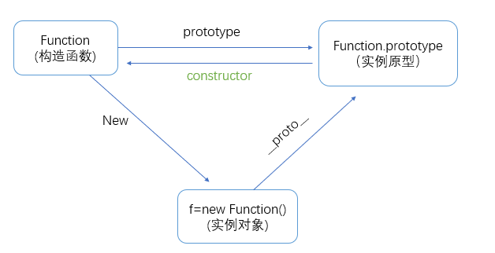

># JavaScript之原型到原型链
- [创建对象与构造函数](#创建对象与构造函数)
- [prototype](#prototype)
- [\__proto__](#_proto_)
- [constuctor](#constuctor)
- [原型链](#原型链)
# 创建对象与构造函数
js对象创建的基础实现都是通过构造函数来完成的

例如：
```js
let a = {}
```
等效于：
```js
let a = new Object()
```
new方法的原理：
```js
function () {

    let obj = {}; //初始化一个对象obj

    obj.proto = Object.prototype;//原型链关联

    Object.call(obj) //即构造或初始化obj对象

    return obj // 抛出
}
```
# prototype

每一个js对象(null除外)创建的时候都会跟另一个对象相关联，如new方法中的  ***原型链关联*** 的逻辑，那么实例对象a的实例原型就是Object.prototype,或者说实例a就是new方法操作构造函数Object的实例原型Object.prototype创建出来的。

prototype就是a的实例原型，关系如下图表示：


接下里介绍另一个重要属性__proto__。

*注意：prototype的值是一个对象，只有构造函数会有这个prototype属性。*

# \__proto__
__proto__是每一个js对象（null除外）都具有的属性，这个属性会指向它的原型，即构造函数的prototype。
所以，原型可以被2条线指向，一个是构造函数Function的prototype，一个是实例对象__proto__。


# constuctor
既然实例和构造函数都可以指向实例，那么原型是否可以指向构造函数和实例呢？
原型指向实例没有，因为一个构造函数可以生成多个实例，但是原型可以指向构造函数，就是constructor。

验证如下：
```js
function Person (){

}
let person = new Person
console.log(Person == Person.prototype.constructor)//true
console.log(person.__proto__.constructor == Person)//true
console.log(person.constructor == Person)//true
```


注意：当获取person.constructor属性时，由于person本身没有，就会沿着person.__proto__去找，找到Person.prototype有该属性时，直接读取，即Person。

另外对于__proto__,其实并不存在于Person.prototype中，来自于Object.prototype,当使用obj.__proto__时，可以理解成返回了Object.getPrototypeOf(obj)

# 原型链
JavaScript对象的基础就是构造函数创建实例对象，由于实例与构造函数是通过__proto__来进行链接的，所以js对象间就形成了以__proto__为纽带互相连接的结构链，即原型链。

实例对象查找属性时，会沿着原型链依次查询，如果有则读取，如果直到最终的节点null都没有查到，则该属性不存在。

原型链的示意图如下：


Object.prototype的原型是null,可以说没有原型，null也没有原型。

原型例子：
```js
function Person(){

}
let a = {}
let b = new Person()
console.log(a.prototype); // undefined
console.log(a.__proto__); // Object.prototype
console.log(a.__proto__.__proto__); // null
console.log(a.constructor); // Object

console.log(b.prototype); // Function
console.log(b.__proto__); // Person.prototype
console.log(b.__proto__.__proto__); // Function.prototype
console.log(b.__proto__.__proto__.__proto__); // Object.prototype
console.log(b.__proto__.__proto__.__proto__.__proto__); //null
console.log(b.constructor); // Person

```

>## 下一篇文章
[《JavaScript之数据类型判断#2》](https://github.com/)
